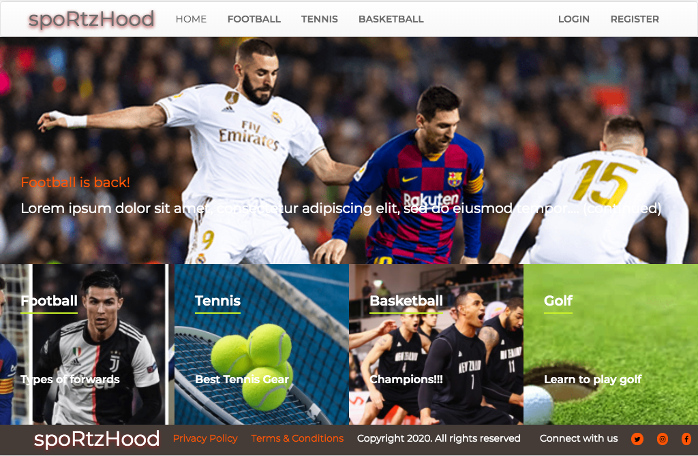
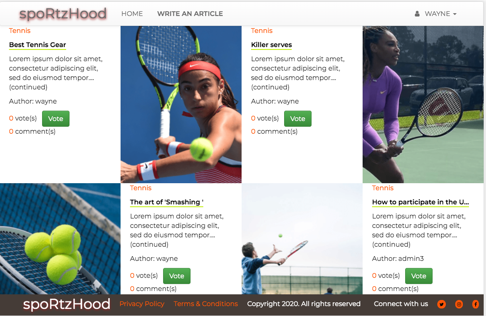

# sportzhood

> This is the Ruby on Rails Microverse Capstone project built to mimic the lifestyle articles website redesign. The theme for this web desktop app, however, is a sports blog.

## Web App Screenshots

### Web App Home Page


### Web App Articles Page


## Built With

- Ruby v2.7.0
- Ruby on Rails v5.2.4
- Bootstrap-sass gem
- Carrierwave gem
- Cloudinary gem
- Figaro gem
- Font-awesome-rails gem

## Live Demo

Click [here](https://sportzhood.herokuapp.com/) to visit a live version of the web app.

## Video Presentation

Click [here](https://www.loom.com/share/5db0dc9d9b8d4b0b9344fd0f07539e99) for a video presentation.

## Getting Started

To get a local copy up and running follow these simple example steps.

### Prerequisites

Ruby: 2.6.3
Rails: 5.2.3
Postgres: >=9.5

### Setup

Install gems with:

```
bundle install
```

Setup database with:

```
   rails db:create
   rails db:migrate
```

Populate database with:

```
   rails db:seed
```

Setup cloudinary:

Go through [this article](https://cloudinary.com/documentation/rails_integration) to setup cloudinary for image upload and manipulation.

[This](http://railsapps.github.io/rails-environment-variables.html) is useful to set your environment variables.

### Usage

Start server with:

```
    rails server
```

Open `http://localhost:3000/` in your browser.

### Run tests

```
    rpsec --format documentation
```

### Deployment

This app was deployed on [heroku.](https://www.google.com/url?sa=t&rct=j&q=&esrc=s&source=web&cd=&cad=rja&uact=8&ved=2ahUKEwjGkq6A4c7qAhVyt3EKHYKfAOwQFjAAegQIARAC&url=https%3A%2F%2Fwww.heroku.com%2F&usg=AOvVaw1V4lhSv6mb_lZj6UUCUXpS)

## Author

👤 **Christopher Amanor**

- Github: [@krys2fa](https://github.com/krys2fa)
- Twitter: [@krys2fa](https://twitter.com/krys2fa)
- Linkedin: [Christopher Amanor](https://www.linkedin.com/in/christopher-amanor/)

## 🤝 Contributing

Contributions, issues and feature requests are welcome!

Feel free to check the [issues page](issues/).

## Show your support

Kindly give this repository a ⭐️ if you like this project!

## Acknowledgments

- Project specifications by [Microverse](https://www.microverse.org).
- Design idea by [Nelson Sakwa](https://www.behance.net/sakwadesignstudio) on [Behance](https://www.behance.net/sakwadesignstudio).
- All images used images downloaded from searching on [Google](https://www.google.com).

## 📝 License

This project is licensed under the MIT License.
